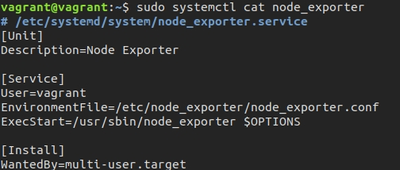

1. 
```
$ wget https://github.com/prometheus/node_exporter/releases/download/v1.1.2/node_exporter-1.1.2.linux-amd64.tar.gz
$ tar -xf node_exporter-1.1.2.linux-amd64.tar.gz
$ sudo mkdir /etc/node_exporter
$ sudo mv node_exporter-1.1.2.linux-amd64/node_exporter /etc/node_exporter
$ sudo touch /etc/node_exporter/node_exporter.conf
$ sudo chown vagrant:vagrant !$
$ sudo ln -s /etc/node_exporter/node_exporter /usr/sbin/node_exporter
$ sudo systemctl edit --force --full node_exporter.service
```

```
$ sudo systemctl daemon-reload
$ sudo systemctl enable --now node_exporter
```


2. С выводом /metrics ознакомился:  
`$ curl http://localhost:9100/metrics`  
Выбрал такие опции:  
`$ cat /etc/node_exporter/node_exporter.conf`  
OPTIONS = "--collector.disable-defaults --collector.cpu --collector.meminfo --collector.netdev --collector.filesystem --collector.diskstats --collector.uname"  
3. Пакет установил, внес необходимые изменения в конфигурации netdata и vagrant. Ознакомился.


4. Да:
```
$ dmesg | grep -i virt
[    0.000000] DMI: innotek GmbH VirtualBox/VirtualBox, BIOS VirtualBox 12/01/2006
[    0.003035] CPU MTRRs all blank - virtualized system.
[    0.086036] Booting paravirtualized kernel on KVM
[    2.669136] systemd[1]: Detected virtualization oracle.
```
5. Значение `sysctl -n fs.nr_open` это максимальное количество открытых дескрипторов файлов. По умолчанию - 1024*1024 (1048576).  
   Такой же лимит `ulimit -n` у него есть два параметра `ulimit -Sn` - это мягкий лимит который установлен для пользователя прямо сейчас и может быть при необходимости увеличен и `ulimit -Hn` - жесткий лимит, максимально доспустимый, может быть изменен только root.  
6.
```
$ sudo -i
root@vagrant:/home/vagrant# screen
root@vagrant:/home/vagrant# unshare -f --pid --mount-proc /bin/bash
root@vagrant:/home/vagrant# sleep 1h &
[1] 8
root@vagrant:/home/vagrant# ps aux
USER         PID %CPU %MEM    VSZ   RSS TTY      STAT START   TIME COMMAND
root           1  0.0  0.3  11560  4008 pts/1    S    15:48   0:00 /bin/bash
root           8  0.0  0.0   9828   592 pts/1    S    15:50   0:00 sleep 1h
root          13  0.0  0.3  13216  3268 pts/1    R+   15:51   0:00 ps aux

CTRL+A, CTRL+D

[detached from 2090.pts-0.vagrant]
root@vagrant:/home/vagrant# ps aux | grep sleep
root        2106  0.0  0.0   9828   584 pts/1    S    15:57   0:00 sleep 1h
root        2123  0.0  0.0  10760   672 pts/0    S+   15:58   0:00 grep --color=auto sleep
root@vagrant:/home/vagrant# nsenter --target 2106 --pid --mount
root@vagrant:/# ps aux
USER         PID %CPU %MEM    VSZ   RSS TTY      STAT START   TIME COMMAND
root           1  0.0  0.3  11560  3864 pts/1    S+   15:57   0:00 /bin/bash
root           8  0.0  0.0   9828   584 pts/1    S    15:57   0:00 sleep 1h
root          10  0.0  0.3  11560  3884 pts/0    S    16:00   0:00 -bash
root          19  0.0  0.3  13216  3368 pts/0    R+   16:00   0:00 ps aux
```
7. 
`:(){ :|:& };:` - это fork-бомба, программа бесконечно своздает свои копии создавая функцию в теле которой она выполняет себя же и передает через pipe себе же в фоне.

Стабилизировалось всё за счет того что сработал лимит cgroups:  
`[ 5055.499223] cgroup: fork rejected by pids controller in /user.slice/user-1000.slice/session-3.scope`  
Systemd создает cgroup для каждого пользователя, и устанавливает на нее лимиты (33% от максимума):  
`$ cat /usr/lib/systemd/system/user-.slice.d/10-defaults.conf`  
...  
[Slice]  
TasksMax=33%  
...  
Максимум можно узнать командой:  
`$ sysctl -n kernel.threads-max`  
7151  
Изменить этот максимум можно или отредактировав значение в /usr/lib/systemd/system/user-.slice.d/10-defaults.conf или через `ulimit -u` (но только в текущей сессии).
