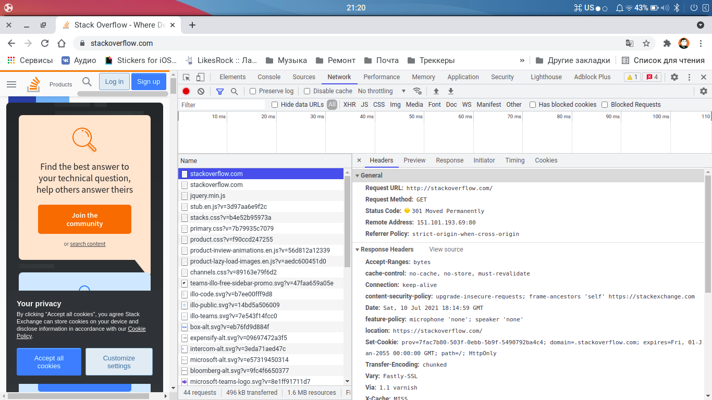

1. HTTP/1.1 301 Moved Permanently - дословно означает что страница навсегда перемещена и в location указывает куда, произошло это из-за настроек на стороне сервера stackoverflow.com, которые говорят нам, что сайт работает на https (а мы обращались на http по 80 порту).
```
$ telnet stackoverflow.com 80
Trying 151.101.1.69...
Connected to stackoverflow.com.
Escape character is '^]'.
GET /questions HTTP/1.0
HOST: stackoverflow.com

HTTP/1.1 301 Moved Permanently
cache-control: no-cache, no-store, must-revalidate
location: https://stackoverflow.com/questions
x-request-guid: 0e7c7904-ce54-4103-83ce-19760faaf200
feature-policy: microphone 'none'; speaker 'none'
content-security-policy: upgrade-insecure-requests; frame-ancestors 'self' https://stackexchange.com
Accept-Ranges: bytes
Date: Sat, 10 Jul 2021 17:56:37 GMT
Via: 1.1 varnish
Connection: close
X-Served-By: cache-fra19181-FRA
X-Cache: MISS
X-Cache-Hits: 0
X-Timer: S1625939798.518754,VS0,VE92
Vary: Fastly-SSL
X-DNS-Prefetch-Control: off
Set-Cookie: prov=db30c6ce-1e59-3b24-e1f9-b89a35682484; domain=.stackoverflow.com; expires=Fri, 01-Jan-2055 00:00:00 GMT; path=/; HttpOnly

Connection closed by foreign host.
```
2. Код был такой же, как и в первом примере 301. Дольше всего грузился https://stackoverflow.com

   
3. 
```
$ dig +short myip.opendns.com @resolver1.opendns.com
109.252.131.82
```
4. IP адрес принадлежит Moscow Local Telephone Network (OAO MGTS), номер автономной системы: AS25513.
``` 
$ whois -h whois.ripe.net 109.252.131.82
% This is the RIPE Database query service.
% The objects are in RPSL format.
%
% The RIPE Database is subject to Terms and Conditions.
% See http://www.ripe.net/db/support/db-terms-conditions.pdf

% Note: this output has been filtered.
%       To receive output for a database update, use the "-B" flag.

% Information related to '109.252.128.0 - 109.252.255.255'

% Abuse contact for '109.252.128.0 - 109.252.255.255' is 'abuse@spd-mgts.ru'

inetnum:        109.252.128.0 - 109.252.255.255
netname:        MGTS-PPPOE
descr:          Moscow Local Telephone Network (OAO MGTS)
country:        RU
admin-c:        USPD-RIPE
tech-c:         USPD-RIPE
status:         ASSIGNED PA
mnt-by:         MGTS-USPD-MNT
created:        2009-12-10T11:10:14Z
last-modified:  2009-12-10T11:10:14Z
source:         RIPE

role:           PJSC Moscow City Telephone Network NOC
address:        USPD MGTS
address:        Moscow, Russia
address:        Khachaturyana 5
admin-c:        AGS9167-RIPE
admin-c:        AVK103-RIPE
admin-c:        GIA45-RIPE
tech-c:         AVK103-RIPE
tech-c:         VMK
tech-c:         ANO3-RIPE
abuse-mailbox:  abuse@spd-mgts.ru
nic-hdl:        USPD-RIPE
mnt-by:         MGTS-USPD-MNT
created:        2006-09-11T07:56:01Z
last-modified:  2021-04-13T10:41:35Z
source:         RIPE # Filtered

% Information related to '109.252.0.0/16AS25513'

route:          109.252.0.0/16
descr:          Moscow Local Telephone Network (OAO MGTS)
descr:          Moscow, Russia
origin:         AS25513
mnt-by:         MGTS-USPD-MNT
created:        2010-06-30T16:15:54Z
last-modified:  2010-06-30T16:15:54Z
source:         RIPE

% This query was served by the RIPE Database Query Service version 1.101 (BLAARKOP)
```
5. 
``` 
$ traceroute -An 8.8.8.8
traceroute to 8.8.8.8 (8.8.8.8), 30 hops max, 60 byte packets
 1  * * *
 2  100.82.0.1 [*]  4.419 ms  4.654 ms  4.620 ms
 3  212.188.1.106 [AS8359]  16.909 ms  16.683 ms  16.838 ms
 4  212.188.1.105 [AS8359]  5.671 ms  6.170 ms  5.842 ms
 5  195.34.50.74 [AS8359]  6.480 ms  6.728 ms  7.184 ms
 6  212.188.29.82 [AS8359]  6.863 ms  5.162 ms  5.366 ms
 7  108.170.250.113 [AS15169]  20.785 ms 108.170.250.51 [AS15169]  19.885 ms 108.170.250.34 [AS15169]  17.092 ms
 8  172.253.66.116 [AS15169]  32.603 ms 142.251.49.78 [AS15169]  31.557 ms *
 9  108.170.232.251 [AS15169]  33.857 ms 72.14.235.69 [AS15169]  28.095 ms  27.328 ms
10  172.253.79.169 [AS15169]  27.377 ms 142.250.56.129 [AS15169]  25.502 ms 216.239.58.53 [AS15169]  23.335 ms
11  * * *
12  * * *
13  * * *
14  * * *
15  * * *
16  * * *
17  * * *
18  * * *
19  * * *
20  8.8.8.8 [AS15169]  18.986 ms  19.496 ms  16.747 ms
```
6. `mtr -zn 8.8.8.8`, наибольшая задержка на хосте `216.239.48.85`  
```
                          My traceroute  [v0.93]
f1tz-linux (192.168.1.9)                          2021-07-10T21:51:43+0300
Keys:  Help   Display mode   Restart statistics   Order of fields   quit
                                  Packets               Pings
 Host                           Loss%   Snt   Last   Avg  Best  Wrst StDev
 1. (waiting for reply)
 2. AS???    100.82.0.1          0.0%    74    3.4   3.3   3.0   5.1   0.3
 3. AS8359   212.188.1.106       0.0%    74    4.7   5.6   4.2  15.6   2.1
 4. AS8359   212.188.1.105       0.0%    74    4.0   4.1   3.7   5.1   0.3
 5. AS8359   195.34.50.74        0.0%    74    5.2   5.2   4.7   6.5   0.3
 6. AS8359   212.188.29.82       0.0%    74    5.2   5.0   4.2   7.5   0.5
 7. AS15169  108.170.250.113     0.0%    74    8.0   6.9   4.5  27.4   4.6
 8. AS15169  142.251.49.158     64.4%    74   19.3  21.3  19.1  41.4   4.9
 9. AS15169  216.239.43.20       0.0%    74   20.9  22.7  20.7  67.6   6.1
10. AS15169  216.239.48.85       0.0%    73   22.7  23.1  22.5  24.5   0.4
11. (waiting for reply)
12. (waiting for reply)
13. (waiting for reply)
14. (waiting for reply)
15. (waiting for reply)
16. (waiting for reply)
17. (waiting for reply)
18. (waiting for reply)
19. (waiting for reply)
20. (waiting for reply)
21. (waiting for reply)
22. AS15169  8.8.8.8             0.0%    73   17.6  18.6  17.6  48.3   4.3
```
7. За dns.google. отвечают авторизированные DNS-серверы:
```dns.google.		10800	IN	NS	ns1.zdns.google.
dns.google.		10800	IN	NS	ns3.zdns.google.
dns.google.		10800	IN	NS	ns4.zdns.google.
dns.google.		10800	IN	NS	ns2.zdns.google.
```
A-записи:
``` 
dns.google.		900	IN	A	8.8.4.4
dns.google.		900	IN	A	8.8.8.8
```
```
$ dig +trace dns.google

; <<>> DiG 9.16.1-Ubuntu <<>> +trace dns.google
;; global options: +cmd
.			78104	IN	NS	a.root-servers.net.
.			78104	IN	NS	j.root-servers.net.
.			78104	IN	NS	k.root-servers.net.
.			78104	IN	NS	d.root-servers.net.
.			78104	IN	NS	c.root-servers.net.
.			78104	IN	NS	m.root-servers.net.
.			78104	IN	NS	l.root-servers.net.
.			78104	IN	NS	h.root-servers.net.
.			78104	IN	NS	e.root-servers.net.
.			78104	IN	NS	i.root-servers.net.
.			78104	IN	NS	g.root-servers.net.
.			78104	IN	NS	f.root-servers.net.
.			78104	IN	NS	b.root-servers.net.
;; Received 262 bytes from 127.0.0.53#53(127.0.0.53) in 4 ms

google.			172800	IN	NS	ns-tld1.charlestonroadregistry.com.
google.			172800	IN	NS	ns-tld2.charlestonroadregistry.com.
google.			172800	IN	NS	ns-tld3.charlestonroadregistry.com.
google.			172800	IN	NS	ns-tld4.charlestonroadregistry.com.
google.			172800	IN	NS	ns-tld5.charlestonroadregistry.com.
google.			86400	IN	DS	6125 8 2 80F8B78D23107153578BAD3800E9543500474E5C30C29698B40A3DB2 3ED9DA9F
google.			86400	IN	RRSIG	DS 8 1 86400 20210723170000 20210710160000 26838 . Mbb4biuRQJn8bpvHFBCMxbjWHhtNceynHhyJiyXL/xduyl5Vjl27Vb/f ClH2VUXljGmCO1MfUvwr7bVv5n0SIKfIaOzE5XXZihzZ23uFe8C4SaIo v1JilghBz6Lt7TkiGhBOXgFIWEIhfEqknvoW4WPZ6GhvntzKHdt/qFk8 j1XEJjBBu2a6esmXmd5b7xwTEwZIbE3bTiGYecWXfUAbjKJ156kwmktJ xjKwIBYXWzqiX4HJl5qcGUDY8q4nrKhcw65Vjj0x5xeBZimAN8u4iKKZ oEVpvPUtoCh31AbF9/vV1owcKivb/xAGOpLkkfHR9z6y9SP6pwOIxTF+ qr8oBg==
;; Received 730 bytes from 198.97.190.53#53(h.root-servers.net) in 296 ms

dns.google.		10800	IN	NS	ns1.zdns.google.
dns.google.		10800	IN	NS	ns3.zdns.google.
dns.google.		10800	IN	NS	ns4.zdns.google.
dns.google.		10800	IN	NS	ns2.zdns.google.
dns.google.		3600	IN	DS	56044 8 2 1B0A7E90AA6B1AC65AA5B573EFC44ABF6CB2559444251B997103D2E4 0C351B08
dns.google.		3600	IN	RRSIG	DS 8 2 3600 20210729203146 20210707203146 7144 google. AmqQNlM6kzBx7hqP3z8zCYTzBh/rUVjT2v4/mqnfmfh6Y/0Jeug+vkQ9 K3ANmZFh6PkB6GqpBZ8biehldpoTihVo69cSH7AXK7Qnj6ibrRVYM0oT DW9Feyq2whDMXJ2IqLOaTpq7dblKhllnwV3uJU/i0/z14DHbSqabvSsr x9E=
;; Received 506 bytes from 216.239.38.105#53(ns-tld4.charlestonroadregistry.com) in 24 ms

dns.google.		900	IN	A	8.8.4.4
dns.google.		900	IN	A	8.8.8.8
dns.google.		900	IN	RRSIG	A 8 2 900 20210809160923 20210710160923 1773 dns.google. cprFaVTpA5qEr5T8f7abQFB6XDz+tWYYJgS3Nc7EBhBt7kHjz9G6g1gt rJqH03vNz7vrXeinTR2PmTQJKOnov1CLdklmoArqXdwnUY1xBd5+H2Td aIqfZsqN6qoffHDll+n9mSUvugOXPLanna2ntCyoqq3KqIPh/xtr5gna Bng=
;; Received 241 bytes from 216.239.34.114#53(ns2.zdns.google) in 48 ms

```
8. Коротко к IP адресам привязано доменное имя `dns.google.`:
``` 
$ dig +short -x 8.8.8.8
dns.google.
$ dig +short -x 8.8.4.4
dns.google.
```
Полный вывод:
``` 
$ dig -x 8.8.4.4

; <<>> DiG 9.16.1-Ubuntu <<>> -x 8.8.4.4
;; global options: +cmd
;; Got answer:
;; ->>HEADER<<- opcode: QUERY, status: NOERROR, id: 52884
;; flags: qr rd ra; QUERY: 1, ANSWER: 1, AUTHORITY: 0, ADDITIONAL: 1

;; OPT PSEUDOSECTION:
; EDNS: version: 0, flags:; udp: 65494
;; QUESTION SECTION:
;4.4.8.8.in-addr.arpa.		IN	PTR

;; ANSWER SECTION:
4.4.8.8.in-addr.arpa.	7188	IN	PTR	dns.google.

;; Query time: 0 msec
;; SERVER: 127.0.0.53#53(127.0.0.53)
;; WHEN: Сб июл 10 22:02:28 MSK 2021
;; MSG SIZE  rcvd: 73

$ dig -x 8.8.8.8

; <<>> DiG 9.16.1-Ubuntu <<>> -x 8.8.8.8
;; global options: +cmd
;; Got answer:
;; ->>HEADER<<- opcode: QUERY, status: NOERROR, id: 53716
;; flags: qr rd ra; QUERY: 1, ANSWER: 1, AUTHORITY: 0, ADDITIONAL: 1

;; OPT PSEUDOSECTION:
; EDNS: version: 0, flags:; udp: 65494
;; QUESTION SECTION:
;8.8.8.8.in-addr.arpa.		IN	PTR

;; ANSWER SECTION:
8.8.8.8.in-addr.arpa.	51353	IN	PTR	dns.google.

;; Query time: 8 msec
;; SERVER: 127.0.0.53#53(127.0.0.53)
;; WHEN: Сб июл 10 22:02:35 MSK 2021
;; MSG SIZE  rcvd: 73
```