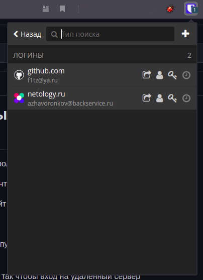

1.

2.

3.

4. 
``` 
$ ./testssl.sh -U --sneaky https://bitwarden.com

###########################################################
    testssl.sh       3.1dev from https://testssl.sh/dev/
    (18dfa26 2021-07-25 16:34:58 -- )

      This program is free software. Distribution and
             modification under GPLv2 permitted.
      USAGE w/o ANY WARRANTY. USE IT AT YOUR OWN RISK!

       Please file bugs @ https://testssl.sh/bugs/

###########################################################

 Using "OpenSSL 1.0.2-chacha (1.0.2k-dev)" [~183 ciphers]
 on f1tz-linux:./bin/openssl.Linux.x86_64
 (built: "Jan 18 17:12:17 2019", platform: "linux-x86_64")


Testing all IPv4 addresses (port 443): 104.18.13.33 104.18.12.33
----------------------------------------------------------------------------------------------------
 Start 2021-07-26 18:25:12        -->> 104.18.13.33:443 (bitwarden.com) <<--

 Further IP addresses:   104.18.12.33 2606:4700::6812:c21 2606:4700::6812:d21 
 rDNS (104.18.13.33):    --
 Service detected:       HTTP


 Testing vulnerabilities 

 Heartbleed (CVE-2014-0160)                not vulnerable (OK), no heartbeat extension
 CCS (CVE-2014-0224)                       not vulnerable (OK)
 Ticketbleed (CVE-2016-9244), experiment.  not vulnerable (OK), no session tickets
 ROBOT                                     not vulnerable (OK)
 Secure Renegotiation (RFC 5746)           OpenSSL handshake didn't succeed
 Secure Client-Initiated Renegotiation     not vulnerable (OK)
 CRIME, TLS (CVE-2012-4929)                not vulnerable (OK)
 BREACH (CVE-2013-3587)                    potentially NOT ok, "gzip" HTTP compression detected. - only supplied "/" tested
                                           Can be ignored for static pages or if no secrets in the page
 POODLE, SSL (CVE-2014-3566)               not vulnerable (OK)
 TLS_FALLBACK_SCSV (RFC 7507)              No fallback possible (OK), no protocol below TLS 1.2 offered
 SWEET32 (CVE-2016-2183, CVE-2016-6329)    not vulnerable (OK)
 FREAK (CVE-2015-0204)                     not vulnerable (OK)
 DROWN (CVE-2016-0800, CVE-2016-0703)      not vulnerable on this host and port (OK)
                                           make sure you don't use this certificate elsewhere with SSLv2 enabled services
                                           https://censys.io/ipv4?q=D0E3930C3E4830193D1DFACCBC757497475F1C874FE6352F4D698AA6E0F74FC4 could help you to find out
 LOGJAM (CVE-2015-4000), experimental      not vulnerable (OK): no DH EXPORT ciphers, no DH key detected with <= TLS 1.2
 BEAST (CVE-2011-3389)                     not vulnerable (OK), no SSL3 or TLS1
 LUCKY13 (CVE-2013-0169), experimental     potentially VULNERABLE, uses cipher block chaining (CBC) ciphers with TLS. Check patches
 Winshock (CVE-2014-6321), experimental    not vulnerable (OK)
 RC4 (CVE-2013-2566, CVE-2015-2808)        no RC4 ciphers detected (OK)


 Done 2021-07-26 18:25:45 [  36s] -->> 104.18.13.33:443 (bitwarden.com) <<--

----------------------------------------------------------------------------------------------------
 Start 2021-07-26 18:25:45        -->> 104.18.12.33:443 (bitwarden.com) <<--

 Further IP addresses:   104.18.13.33 2606:4700::6812:c21 2606:4700::6812:d21 
 rDNS (104.18.12.33):    --
 Service detected:       HTTP


 Testing vulnerabilities 

 Heartbleed (CVE-2014-0160)                not vulnerable (OK), no heartbeat extension
 CCS (CVE-2014-0224)                       not vulnerable (OK)
 Ticketbleed (CVE-2016-9244), experiment.  not vulnerable (OK), no session tickets
 ROBOT                                     not vulnerable (OK)
 Secure Renegotiation (RFC 5746)           OpenSSL handshake didn't succeed
 Secure Client-Initiated Renegotiation     not vulnerable (OK)
 CRIME, TLS (CVE-2012-4929)                not vulnerable (OK)
 BREACH (CVE-2013-3587)                    potentially NOT ok, "gzip" HTTP compression detected. - only supplied "/" tested
                                           Can be ignored for static pages or if no secrets in the page
 POODLE, SSL (CVE-2014-3566)               not vulnerable (OK)
 TLS_FALLBACK_SCSV (RFC 7507)              No fallback possible (OK), no protocol below TLS 1.2 offered
 SWEET32 (CVE-2016-2183, CVE-2016-6329)    not vulnerable (OK)
 FREAK (CVE-2015-0204)                     not vulnerable (OK)
 DROWN (CVE-2016-0800, CVE-2016-0703)      not vulnerable on this host and port (OK)
                                           make sure you don't use this certificate elsewhere with SSLv2 enabled services
                                           https://censys.io/ipv4?q=D0E3930C3E4830193D1DFACCBC757497475F1C874FE6352F4D698AA6E0F74FC4 could help you to find out
 LOGJAM (CVE-2015-4000), experimental      not vulnerable (OK): no DH EXPORT ciphers, no DH key detected with <= TLS 1.2
 BEAST (CVE-2011-3389)                     not vulnerable (OK), no SSL3 or TLS1
 LUCKY13 (CVE-2013-0169), experimental     potentially VULNERABLE, uses cipher block chaining (CBC) ciphers with TLS. Check patches
 Winshock (CVE-2014-6321), experimental    not vulnerable (OK)
 RC4 (CVE-2013-2566, CVE-2015-2808)        no RC4 ciphers detected (OK)


 Done 2021-07-26 18:26:20 [  71s] -->> 104.18.12.33:443 (bitwarden.com) <<--

----------------------------------------------------------------------------------------------------
Done testing now all IP addresses (on port 443): 104.18.13.33 104.18.12.33

```
5. 
``` 
f1tz@f1tz-linux:~$ ssh-copy-id f1tz@127.0.0.1 -p 2234
The authenticity of host '[127.0.0.1]:2234 ([127.0.0.1]:2234)' can't be established.
ECDSA key fingerprint is SHA256:auY7q1jNXpTyWdVw/KSz4/4FWhAy7d9uTpGi8BxAbmw.
Are you sure you want to continue connecting (yes/no/[fingerprint])? yes
/usr/bin/ssh-copy-id: INFO: attempting to log in with the new key(s), to filter out any that are already installed
/usr/bin/ssh-copy-id: INFO: 1 key(s) remain to be installed -- if you are prompted now it is to install the new keys
f1tz@127.0.0.1's password: 

Number of key(s) added: 1

Now try logging into the machine, with:   "ssh -p '2234' 'f1tz@127.0.0.1'"
and check to make sure that only the key(s) you wanted were added.

f1tz@f1tz-linux:~$ ssh f1tz@127.0.0.1 -p 2234
Welcome to Ubuntu 20.04.2 LTS (GNU/Linux 5.4.0-80-generic x86_64)

 * Documentation:  https://help.ubuntu.com
 * Management:     https://landscape.canonical.com
 * Support:        https://ubuntu.com/advantage

  System information as of Tue 27 Jul 2021 07:25:15 AM UTC

  System load:  0.02               Processes:               125
  Usage of /:   22.1% of 18.57GB   Users logged in:         0
  Memory usage: 10%                IPv4 address for enp0s3: 10.0.2.15
  Swap usage:   0%


63 updates can be installed immediately.
0 of these updates are security updates.
To see these additional updates run: apt list --upgradable


To run a command as administrator (user "root"), use "sudo <command>".
See "man sudo_root" for details.

f1tz@test:~$ 
```
6.
``` 
f1tz@f1tz-linux:~$ cat .ssh/config 
Host test 
HostName 127.0.0.1
IdentityFile ~/.ssh/key_for_test.key  
User f1tz  
Port 2234  
f1tz@f1tz-linux:~$ ssh test
Welcome to Ubuntu 20.04.2 LTS (GNU/Linux 5.4.0-80-generic x86_64)

 * Documentation:  https://help.ubuntu.com
 * Management:     https://landscape.canonical.com
 * Support:        https://ubuntu.com/advantage

  System information as of Tue 27 Jul 2021 07:33:43 AM UTC

  System load:  0.0                Processes:               119
  Usage of /:   22.1% of 18.57GB   Users logged in:         0
  Memory usage: 10%                IPv4 address for enp0s3: 10.0.2.15
  Swap usage:   0%


63 updates can be installed immediately.
0 of these updates are security updates.
To see these additional updates run: apt list --upgradable


Last login: Tue Jul 27 07:25:16 2021 from 10.0.2.2
To run a command as administrator (user "root"), use "sudo <command>".
See "man sudo_root" for details.

f1tz@test:~$ 
```
7.
``` 
f1tz@f1tz-linux:~$ sudo tcpdump -w 0001.pcap -c 100 -i wlp2s0
[sudo] пароль для f1tz: 
tcpdump: listening on wlp2s0, link-type EN10MB (Ethernet), capture size 262144 bytes
100 packets captured
101 packets received by filter
0 packets dropped by kernel
```
