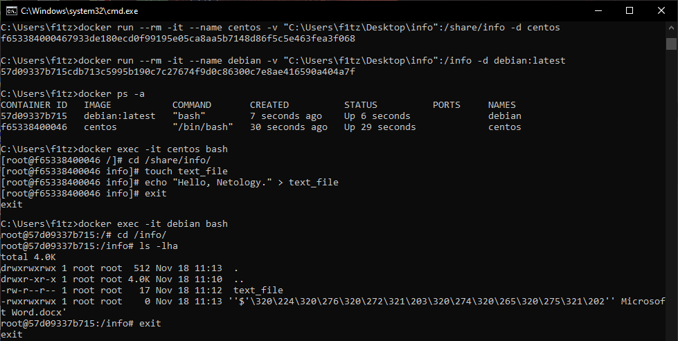

1. Для высоконагруженного монолитного java приложения я бы использовал VM или физическую машину.  
Для GO-микросервиса подойдет docker.  
Для Nodejs в целом подходит docker но в завсимости от ситуации Иногда, при высокой нагруженности, правильнее использовать VM.  
Для мобильного приложения не подходит не докер, не VM.  
Для кешируещего postgresql сервера будет правильнее использовать VM, так как требуется высокая производительность.  
Для Apache Kafka docker подойдет, не думаю что брокер сообщений, даже написанный на java будет сильно нагружен.  
Для Elasticsearch подходит docker, как и для его обвязок.  
Для prometheus и grafana docker будет подходящим решением.  
Для mongodb я бы использовал VM или физический сервер, что бы не терять производительность и не усложнать управление БД.  
Для Jenkins подойдет docker окружние.  
  
  
2. https://hub.docker.com/r/f1tz/apache
  

3.    
