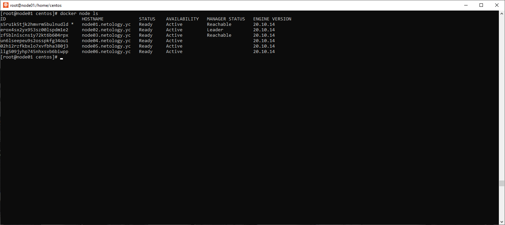
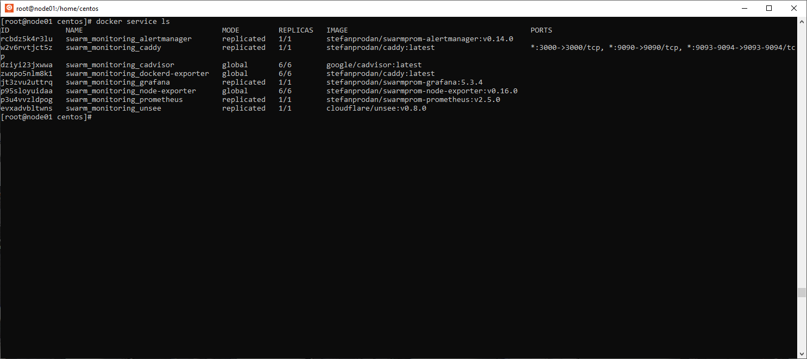

1.
  * В режиме replication создаюся копии сервисов в количестве указанном в конфигурации, где конкретно создадутся копии зависит от конфигурации и доступных ресурсов.
  * В режиме global создется по сервису на каждой из доступных нод.
----------------------
  * Raft
----------------------
  * Overlay Network создает внутреннюю приватную сеть охватывающую все узлы в кластере Docker Swarm. Облегчает обмен данными между Docker Swarm и контейнерами или между двумя контейнерами на разных нодах.
----------------------
2.  
  
3.  
  

