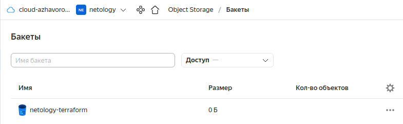

# Домашнее задание к занятию "7.3. Основы и принцип работы Терраформ"

## Задача 1. Создадим бэкэнд в S3 (необязательно, но крайне желательно).

Если в рамках предыдущего задания у вас уже есть аккаунт AWS, то давайте продолжим знакомство со взаимодействием
терраформа и aws. 

1. Создайте s3 бакет, iam роль и пользователя от которого будет работать терраформ. Можно создать отдельного пользователя,
а можно использовать созданного в рамках предыдущего задания, просто добавьте ему необходимы права, как описано 
[здесь](https://www.terraform.io/docs/backends/types/s3.html).
1. Зарегистрируйте бэкэнд в терраформ проекте как описано по ссылке выше. 

## Ответ:  
  
Создал бакет.  
  
  
## Задача 2. Инициализируем проект и создаем воркспейсы. 

1. Выполните `terraform init`:
    * если был создан бэкэнд в S3, то терраформ создат файл стейтов в S3 и запись в таблице 
dynamodb.
    * иначе будет создан локальный файл со стейтами.  
1. Создайте два воркспейса `stage` и `prod`.
1. В уже созданный `aws_instance` добавьте зависимость типа инстанса от вокспейса, что бы в разных ворскспейсах 
использовались разные `instance_type`.
1. Добавим `count`. Для `stage` должен создаться один экземпляр `ec2`, а для `prod` два. 
1. Создайте рядом еще один `aws_instance`, но теперь определите их количество при помощи `for_each`, а не `count`.
1. Что бы при изменении типа инстанса не возникло ситуации, когда не будет ни одного инстанса добавьте параметр
жизненного цикла `create_before_destroy = true` в один из рессурсов `aws_instance`.
1. При желании поэкспериментируйте с другими параметрами и рессурсами.

В виде результата работы пришлите:
* Вывод команды `terraform workspace list`.
* Вывод команды `terraform plan` для воркспейса `prod`.  

```
f1tz@notebook:~/07_03$ terraform workspace list
  default
* prod
  stage
```
```
f1tz@notebook:~/07_03$ terraform plan

Terraform used the selected providers to generate the following execution plan. Resource actions are indicated with the following symbols:
  + create

Terraform will perform the following actions:

  # yandex_compute_instance.inst[0] will be created
  + resource "yandex_compute_instance" "inst" {
      + created_at                = (known after apply)
      + folder_id                 = (known after apply)
      + fqdn                      = (known after apply)
      + hostname                  = "count-prod-1.netology.ru"
      + id                        = (known after apply)
      + metadata                  = {
          + "ssh-keys" = <<-EOT
                ubuntu:ssh-rsa AAAAB3NzaC1yc2EAAAADAQABAAABgQCp+ZDlq6LkNMLPDFn8/HFM8KpVv3u+HYrkhyx3ulM7qScWcootRQ59OEfRi8pNigs8o8edSbZ+tgNQgDk3xm5O8sQDMEHRFaaAuAF6JwOgZXU2NlfEgIQ7IJ5Y6u2EsjW35MRIeKzoTPxBQwu4pM5yoqaQ2NUP+BiT9ntGzqBqRsTmgxykM9XH0EG8xFEAcqQvNUt9tsTXqjVdoXz2/xAMU1nwjitzkr5lGAS3JK+IRWYi7J704Orv78e0rPVlU7UfP97hDuNtno4nNB5Re8Qj6YBq87Rax+iemi+jE9id6/7f6diHGaDGwmnT3P4TllBGKmmJ8kfqATHZXD4Pcx1q92R37tT31L90Jnxc6Uf8XwRCPnfn59WP/vpQRnsFTTlKLaeAUMvvNGo+nTyM522lFOwstUkyE7MrYd9CB+d9byMpkfJ0v8PFHijfSpMh8Fgard5Dl3qgwMmDzdkR5hj0lT1luwfkQS3PK3GZivXG6GogW3TYg/8ww4GMm7gRX6M= f1tz@notebook
            EOT
        }
      + name                      = "count-prod-1"
      + network_acceleration_type = "standard"
      + platform_id               = "standard-v1"
      + service_account_id        = (known after apply)
      + status                    = (known after apply)
      + zone                      = "ru-central1-a"

      + boot_disk {
          + auto_delete = true
          + device_name = (known after apply)
          + disk_id     = (known after apply)
          + mode        = (known after apply)

          + initialize_params {
              + block_size  = (known after apply)
              + description = (known after apply)
              + image_id    = "fd81hgrcv6lsnkremf32"
              + name        = "root-prod-1"
              + size        = 50
              + snapshot_id = (known after apply)
              + type        = "network-nvme"
            }
        }

      + network_interface {
          + index              = (known after apply)
          + ip_address         = (known after apply)
          + ipv4               = true
          + ipv6               = (known after apply)
          + ipv6_address       = (known after apply)
          + mac_address        = (known after apply)
          + nat                = true
          + nat_ip_address     = (known after apply)
          + nat_ip_version     = (known after apply)
          + security_group_ids = (known after apply)
          + subnet_id          = (known after apply)
        }

      + placement_policy {
          + host_affinity_rules = (known after apply)
          + placement_group_id  = (known after apply)
        }

      + resources {
          + core_fraction = 100
          + cores         = 4
          + memory        = 4
        }

      + scheduling_policy {
          + preemptible = (known after apply)
        }
    }

  # yandex_compute_instance.inst[1] will be created
  + resource "yandex_compute_instance" "inst" {
      + created_at                = (known after apply)
      + folder_id                 = (known after apply)
      + fqdn                      = (known after apply)
      + hostname                  = "count-prod-2.netology.ru"
      + id                        = (known after apply)
      + metadata                  = {
          + "ssh-keys" = <<-EOT
                ubuntu:ssh-rsa AAAAB3NzaC1yc2EAAAADAQABAAABgQCp+ZDlq6LkNMLPDFn8/HFM8KpVv3u+HYrkhyx3ulM7qScWcootRQ59OEfRi8pNigs8o8edSbZ+tgNQgDk3xm5O8sQDMEHRFaaAuAF6JwOgZXU2NlfEgIQ7IJ5Y6u2EsjW35MRIeKzoTPxBQwu4pM5yoqaQ2NUP+BiT9ntGzqBqRsTmgxykM9XH0EG8xFEAcqQvNUt9tsTXqjVdoXz2/xAMU1nwjitzkr5lGAS3JK+IRWYi7J704Orv78e0rPVlU7UfP97hDuNtno4nNB5Re8Qj6YBq87Rax+iemi+jE9id6/7f6diHGaDGwmnT3P4TllBGKmmJ8kfqATHZXD4Pcx1q92R37tT31L90Jnxc6Uf8XwRCPnfn59WP/vpQRnsFTTlKLaeAUMvvNGo+nTyM522lFOwstUkyE7MrYd9CB+d9byMpkfJ0v8PFHijfSpMh8Fgard5Dl3qgwMmDzdkR5hj0lT1luwfkQS3PK3GZivXG6GogW3TYg/8ww4GMm7gRX6M= f1tz@notebook
            EOT
        }
      + name                      = "count-prod-2"
      + network_acceleration_type = "standard"
      + platform_id               = "standard-v1"
      + service_account_id        = (known after apply)
      + status                    = (known after apply)
      + zone                      = "ru-central1-a"

      + boot_disk {
          + auto_delete = true
          + device_name = (known after apply)
          + disk_id     = (known after apply)
          + mode        = (known after apply)

          + initialize_params {
              + block_size  = (known after apply)
              + description = (known after apply)
              + image_id    = "fd81hgrcv6lsnkremf32"
              + name        = "root-prod-2"
              + size        = 50
              + snapshot_id = (known after apply)
              + type        = "network-nvme"
            }
        }

      + network_interface {
          + index              = (known after apply)
          + ip_address         = (known after apply)
          + ipv4               = true
          + ipv6               = (known after apply)
          + ipv6_address       = (known after apply)
          + mac_address        = (known after apply)
          + nat                = true
          + nat_ip_address     = (known after apply)
          + nat_ip_version     = (known after apply)
          + security_group_ids = (known after apply)
          + subnet_id          = (known after apply)
        }

      + placement_policy {
          + host_affinity_rules = (known after apply)
          + placement_group_id  = (known after apply)
        }

      + resources {
          + core_fraction = 100
          + cores         = 4
          + memory        = 4
        }

      + scheduling_policy {
          + preemptible = (known after apply)
        }
    }

  # yandex_compute_instance.inst2["3"] will be created
  + resource "yandex_compute_instance" "inst2" {
      + created_at                = (known after apply)
      + folder_id                 = (known after apply)
      + fqdn                      = (known after apply)
      + hostname                  = "each-prod-3.netology.ru"
      + id                        = (known after apply)
      + metadata                  = {
          + "ssh-keys" = <<-EOT
                ubuntu:ssh-rsa AAAAB3NzaC1yc2EAAAADAQABAAABgQCp+ZDlq6LkNMLPDFn8/HFM8KpVv3u+HYrkhyx3ulM7qScWcootRQ59OEfRi8pNigs8o8edSbZ+tgNQgDk3xm5O8sQDMEHRFaaAuAF6JwOgZXU2NlfEgIQ7IJ5Y6u2EsjW35MRIeKzoTPxBQwu4pM5yoqaQ2NUP+BiT9ntGzqBqRsTmgxykM9XH0EG8xFEAcqQvNUt9tsTXqjVdoXz2/xAMU1nwjitzkr5lGAS3JK+IRWYi7J704Orv78e0rPVlU7UfP97hDuNtno4nNB5Re8Qj6YBq87Rax+iemi+jE9id6/7f6diHGaDGwmnT3P4TllBGKmmJ8kfqATHZXD4Pcx1q92R37tT31L90Jnxc6Uf8XwRCPnfn59WP/vpQRnsFTTlKLaeAUMvvNGo+nTyM522lFOwstUkyE7MrYd9CB+d9byMpkfJ0v8PFHijfSpMh8Fgard5Dl3qgwMmDzdkR5hj0lT1luwfkQS3PK3GZivXG6GogW3TYg/8ww4GMm7gRX6M= f1tz@notebook
            EOT
        }
      + name                      = "each-prod-3"
      + network_acceleration_type = "standard"
      + platform_id               = "standard-v1"
      + service_account_id        = (known after apply)
      + status                    = (known after apply)
      + zone                      = "ru-central1-a"

      + boot_disk {
          + auto_delete = true
          + device_name = (known after apply)
          + disk_id     = (known after apply)
          + mode        = (known after apply)

          + initialize_params {
              + block_size  = (known after apply)
              + description = (known after apply)
              + image_id    = "fd81hgrcv6lsnkremf32"
              + name        = "root-prod-3"
              + size        = 50
              + snapshot_id = (known after apply)
              + type        = "network-nvme"
            }
        }

      + network_interface {
          + index              = (known after apply)
          + ip_address         = (known after apply)
          + ipv4               = true
          + ipv6               = (known after apply)
          + ipv6_address       = (known after apply)
          + mac_address        = (known after apply)
          + nat                = true
          + nat_ip_address     = (known after apply)
          + nat_ip_version     = (known after apply)
          + security_group_ids = (known after apply)
          + subnet_id          = (known after apply)
        }

      + placement_policy {
          + host_affinity_rules = (known after apply)
          + placement_group_id  = (known after apply)
        }

      + resources {
          + core_fraction = 100
          + cores         = 4
          + memory        = 4
        }

      + scheduling_policy {
          + preemptible = (known after apply)
        }
    }

  # yandex_compute_instance.inst2["4"] will be created
  + resource "yandex_compute_instance" "inst2" {
      + created_at                = (known after apply)
      + folder_id                 = (known after apply)
      + fqdn                      = (known after apply)
      + hostname                  = "each-prod-4.netology.ru"
      + id                        = (known after apply)
      + metadata                  = {
          + "ssh-keys" = <<-EOT
                ubuntu:ssh-rsa AAAAB3NzaC1yc2EAAAADAQABAAABgQCp+ZDlq6LkNMLPDFn8/HFM8KpVv3u+HYrkhyx3ulM7qScWcootRQ59OEfRi8pNigs8o8edSbZ+tgNQgDk3xm5O8sQDMEHRFaaAuAF6JwOgZXU2NlfEgIQ7IJ5Y6u2EsjW35MRIeKzoTPxBQwu4pM5yoqaQ2NUP+BiT9ntGzqBqRsTmgxykM9XH0EG8xFEAcqQvNUt9tsTXqjVdoXz2/xAMU1nwjitzkr5lGAS3JK+IRWYi7J704Orv78e0rPVlU7UfP97hDuNtno4nNB5Re8Qj6YBq87Rax+iemi+jE9id6/7f6diHGaDGwmnT3P4TllBGKmmJ8kfqATHZXD4Pcx1q92R37tT31L90Jnxc6Uf8XwRCPnfn59WP/vpQRnsFTTlKLaeAUMvvNGo+nTyM522lFOwstUkyE7MrYd9CB+d9byMpkfJ0v8PFHijfSpMh8Fgard5Dl3qgwMmDzdkR5hj0lT1luwfkQS3PK3GZivXG6GogW3TYg/8ww4GMm7gRX6M= f1tz@notebook
            EOT
        }
      + name                      = "each-prod-4"
      + network_acceleration_type = "standard"
      + platform_id               = "standard-v1"
      + service_account_id        = (known after apply)
      + status                    = (known after apply)
      + zone                      = "ru-central1-a"

      + boot_disk {
          + auto_delete = true
          + device_name = (known after apply)
          + disk_id     = (known after apply)
          + mode        = (known after apply)

          + initialize_params {
              + block_size  = (known after apply)
              + description = (known after apply)
              + image_id    = "fd81hgrcv6lsnkremf32"
              + name        = "root-prod-4"
              + size        = 50
              + snapshot_id = (known after apply)
              + type        = "network-nvme"
            }
        }

      + network_interface {
          + index              = (known after apply)
          + ip_address         = (known after apply)
          + ipv4               = true
          + ipv6               = (known after apply)
          + ipv6_address       = (known after apply)
          + mac_address        = (known after apply)
          + nat                = true
          + nat_ip_address     = (known after apply)
          + nat_ip_version     = (known after apply)
          + security_group_ids = (known after apply)
          + subnet_id          = (known after apply)
        }

      + placement_policy {
          + host_affinity_rules = (known after apply)
          + placement_group_id  = (known after apply)
        }

      + resources {
          + core_fraction = 100
          + cores         = 4
          + memory        = 4
        }

      + scheduling_policy {
          + preemptible = (known after apply)
        }
    }

  # yandex_vpc_network.net will be created
  + resource "yandex_vpc_network" "net" {
      + created_at                = (known after apply)
      + default_security_group_id = (known after apply)
      + folder_id                 = (known after apply)
      + id                        = (known after apply)
      + labels                    = (known after apply)
      + name                      = "net"
      + subnet_ids                = (known after apply)
    }

  # yandex_vpc_subnet.sub will be created
  + resource "yandex_vpc_subnet" "sub" {
      + created_at     = (known after apply)
      + folder_id      = (known after apply)
      + id             = (known after apply)
      + labels         = (known after apply)
      + name           = "sub"
      + network_id     = (known after apply)
      + v4_cidr_blocks = [
          + "192.168.10.0/24",
        ]
      + v6_cidr_blocks = (known after apply)
      + zone           = "ru-central1-a"
    }

Plan: 6 to add, 0 to change, 0 to destroy.

Changes to Outputs:
  + count_ext_ip_address = {
      + "count-prod-1.netology.ru" = (known after apply)
      + "count-prod-2.netology.ru" = (known after apply)
    }
  + count_int_ip_address = {
      + "count-prod-1.netology.ru" = (known after apply)
      + "count-prod-2.netology.ru" = (known after apply)
    }
  + each_ext_ip_address  = {
      + "each-prod-3.netology.ru" = (known after apply)
      + "each-prod-4.netology.ru" = (known after apply)
    }
  + each_int_ip_address  = {
      + "each-prod-3.netology.ru" = (known after apply)
      + "each-prod-4.netology.ru" = (known after apply)
    }

─────────────────────────────────────────────────────────────────────────────────────────────────────────────────────────────────────────────────────

Note: You didn't use the -out option to save this plan, so Terraform can't guarantee to take exactly these actions if you run "terraform apply" now.

```
