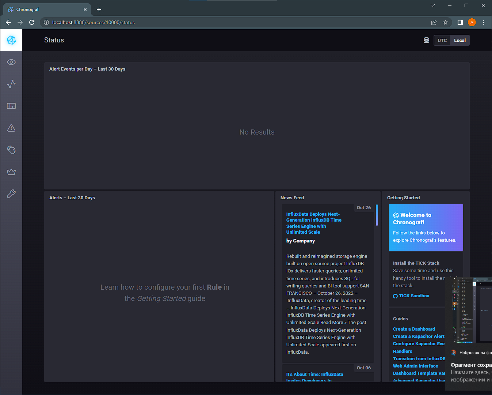
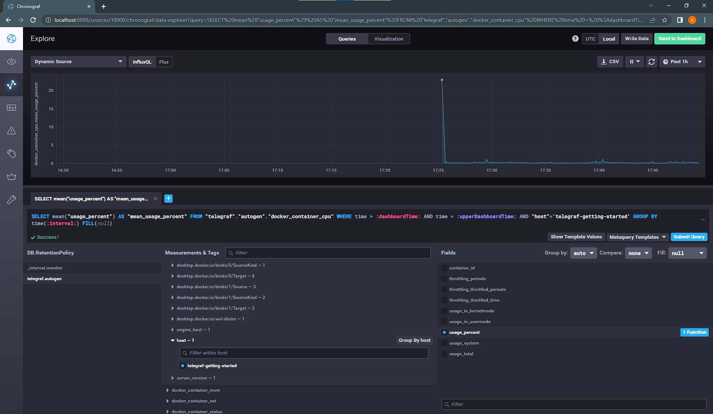
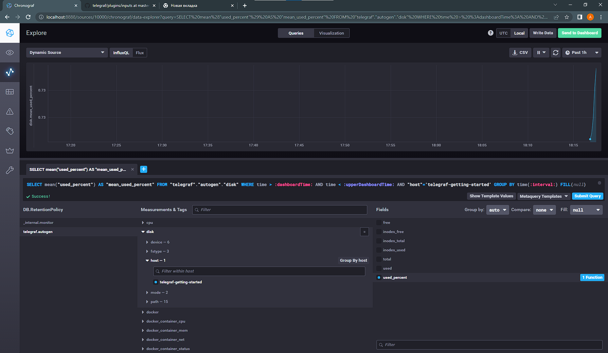

# Домашнее задание к занятию "10.02. Системы мониторинга"

1. Опишите основные плюсы и минусы pull и push систем мониторинга.
```
Pull:
Плюсы:
- Контроль подлинности данных
- Проще дебажить
- Легче администрировать одинаковые источники
Минусы:
- Необходимость сетевого доступа между сервером и хостами
- Меньше производительность при опросе
- Задержки при передаче информация о проблемах 
```
```
Push:
Плюсы:
- Можно настроить отправку в несколько систем мониторинга
- Можно работать по UDP
- Более гибкий график передачи данных
- Узлы могут быть за Firewall'ом
Минусы:
- По UDP возможны потери данных
- Необходимо настраивать на каждом клиенте
- Возможно получение данных от чужих источников
```

2. Какие из ниже перечисленных систем относятся к push модели, а какие к pull? А может есть гибридные?

    - Prometheus - `pull`
    - TICK - `push`
    - Zabbix - `гибридная система`
    - VictoriaMetrics - `гибридная система`
    - Nagios - `push`

3. Склонируйте себе [репозиторий](https://github.com/influxdata/sandbox/tree/master) и запустите TICK-стэк, 
используя технологии docker и docker-compose.

В виде решения на это упражнение приведите выводы команд с вашего компьютера (виртуальной машины):

    - curl http://localhost:8086/ping
    - curl http://localhost:8888
    - curl http://localhost:9092/kapacitor/v1/ping

А также скриншот веб-интерфейса ПО chronograf (`http://localhost:8888`). 

P.S.: если при запуске некоторые контейнеры будут падать с ошибкой - проставьте им режим `Z`, например
`./data:/var/lib:Z`

```
$ curl http://localhost:8086/ping

Ничего в ответ не получил.
```

```html
$ curl http://localhost:8888

<!DOCTYPE html><html><head><link rel="stylesheet" href="/index.c708214f.css"><meta http-equiv="Content-type" content="text/html; charset=utf-8"><title>Chronograf</title><link rel="icon shortcut" href="/favicon.70d63073.ico"></head><body> <div id="react-root" data-basepath=""></div> <script type="module" src="/index.e81b88ee.js"></script><script src="/index.a6955a67.js" nomodule="" defer></script> </body></html>
```

```
$ curl http://localhost:9092/kapacitor/v1/ping

Ничего в ответ не получил.
```

Скриншот:


4. Перейдите в веб-интерфейс Chronograf (`http://localhost:8888`) и откройте вкладку `Data explorer`.

    - Нажмите на кнопку `Add a query`
    - Изучите вывод интерфейса и выберите БД `telegraf.autogen`
    - В `measurments` выберите mem->host->telegraf_container_id , а в `fields` выберите used_percent. 
    Внизу появится график утилизации оперативной памяти в контейнере telegraf.
    - Вверху вы можете увидеть запрос, аналогичный SQL-синтаксису. 
    Поэкспериментируйте с запросом, попробуйте изменить группировку и интервал наблюдений.

Для выполнения задания приведите скриншот с отображением метрик утилизации места на диске 
(disk->host->telegraf_container_id) из веб-интерфейса.  

* Ответ: все похоже с момента лекции прилично изменилось, и у меня даже график со строкой query поменялись местами, на скриншоте % загрузки CPU, диск не показывается, возможно дело в WSL+Docker Desktop.


5. Изучите список [telegraf inputs](https://github.com/influxdata/telegraf/tree/master/plugins/inputs). 
Добавьте в конфигурацию telegraf следующий плагин - [docker](https://github.com/influxdata/telegraf/tree/master/plugins/inputs/docker):
```
[[inputs.docker]]
  endpoint = "unix:///var/run/docker.sock"
```

Дополнительно вам может потребоваться донастройка контейнера telegraf в `docker-compose.yml` дополнительного volume и 
режима privileged:
```
  telegraf:
    image: telegraf:1.4.0
    privileged: true
    volumes:
      - ./etc/telegraf.conf:/etc/telegraf/telegraf.conf:Z
      - /var/run/docker.sock:/var/run/docker.sock:Z
    links:
      - influxdb
    ports:
      - "8092:8092/udp"
      - "8094:8094"
      - "8125:8125/udp"
```

После настройке перезапустите telegraf, обновите веб интерфейс и приведите скриншотом список `measurments` в 
веб-интерфейсе базы telegraf.autogen . Там должны появиться метрики, связанные с docker.

Факультативно можете изучить какие метрики собирает telegraf после выполнения данного задания.

Ответ:

Плагин уже был в файле конфигурации telegraf:
```
[[inputs.docker]]
  endpoint = "unix:///var/run/docker.sock"
  container_names = []
  timeout = "5s"
  perdevice = true
  total = false
```
Вместо этого добавил плагин disk:
```
[[inputs.disk]]
```


---
Вывод curl с verbose:
```
$ curl http://localhost:9092/kapacitor/v1/ping -v
*   Trying 127.0.0.1:9092...
* TCP_NODELAY set
* Connected to localhost (127.0.0.1) port 9092 (#0)
> GET /kapacitor/v1/ping HTTP/1.1
> Host: localhost:9092
> User-Agent: curl/7.68.0
> Accept: */*
> 
* Mark bundle as not supporting multiuse
< HTTP/1.1 204 No Content
< Content-Type: application/json; charset=utf-8
< Request-Id: 029fbe59-58e1-11ed-88f1-0242ac130005
< X-Kapacitor-Version: 1.6.5
< Date: Mon, 31 Oct 2022 05:58:15 GMT
< 
* Connection #0 to host localhost left intact
```

```
$ curl http://localhost:8086/ping -v
*   Trying 127.0.0.1:8086...
* TCP_NODELAY set
* Connected to localhost (127.0.0.1) port 8086 (#0)
> GET /ping HTTP/1.1
> Host: localhost:8086
> User-Agent: curl/7.68.0
> Accept: */*
> 
* Mark bundle as not supporting multiuse
< HTTP/1.1 204 No Content
< Content-Type: application/json
< Request-Id: 1bbbaf34-58e1-11ed-88a4-0242ac130003
< X-Influxdb-Build: OSS
< X-Influxdb-Version: 1.8.10
< X-Request-Id: 1bbbaf34-58e1-11ed-88a4-0242ac130003
< Date: Mon, 31 Oct 2022 05:58:57 GMT
< 
* Connection #0 to host localhost left intact
```

Вывод docker ps -a:
```
$ docker ps -a
CONTAINER ID   IMAGE                   COMMAND                  CREATED        STATUS        PORTS                                                                    NAMES
89bf5b224000   chrono_config           "/entrypoint.sh chro…"   15 hours ago   Up 15 hours   0.0.0.0:8888->8888/tcp                                                   sandbox-chronograf-1
d98714a6e89a   kapacitor               "/entrypoint.sh kapa…"   15 hours ago   Up 15 hours   0.0.0.0:9092->9092/tcp                                                   sandbox-kapacitor-1
a280a891b325   telegraf                "/entrypoint.sh tele…"   15 hours ago   Up 15 hours   8092/udp, 8125/udp, 8094/tcp                                             sandbox-telegraf-1
097cfe78ef8b   sandbox_documentation   "/documentation/docu…"   15 hours ago   Up 15 hours   0.0.0.0:3010->3000/tcp                                                   sandbox-documentation-1
768af03a8ae7   influxdb                "/entrypoint.sh infl…"   15 hours ago   Up 15 hours   0.0.0.0:8082->8082/tcp, 0.0.0.0:8086->8086/tcp, 0.0.0.0:8089->8089/udp   sandbox-influxdb-1
```
