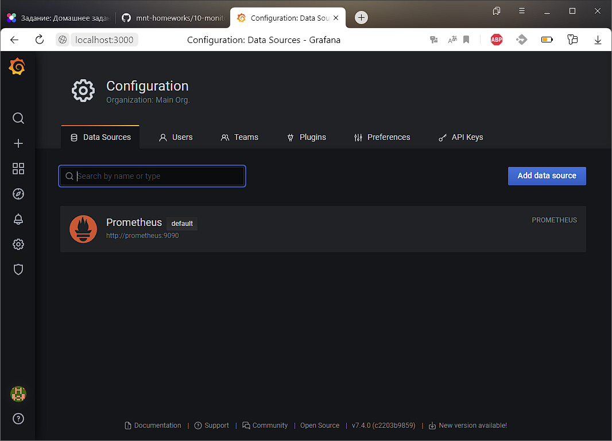
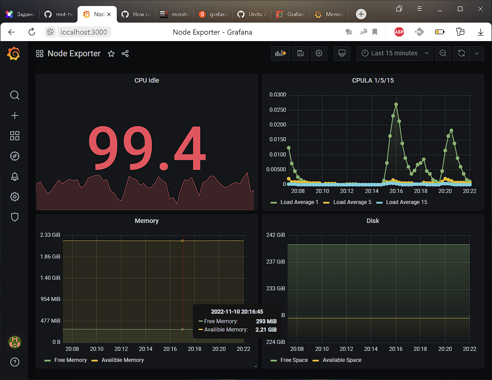
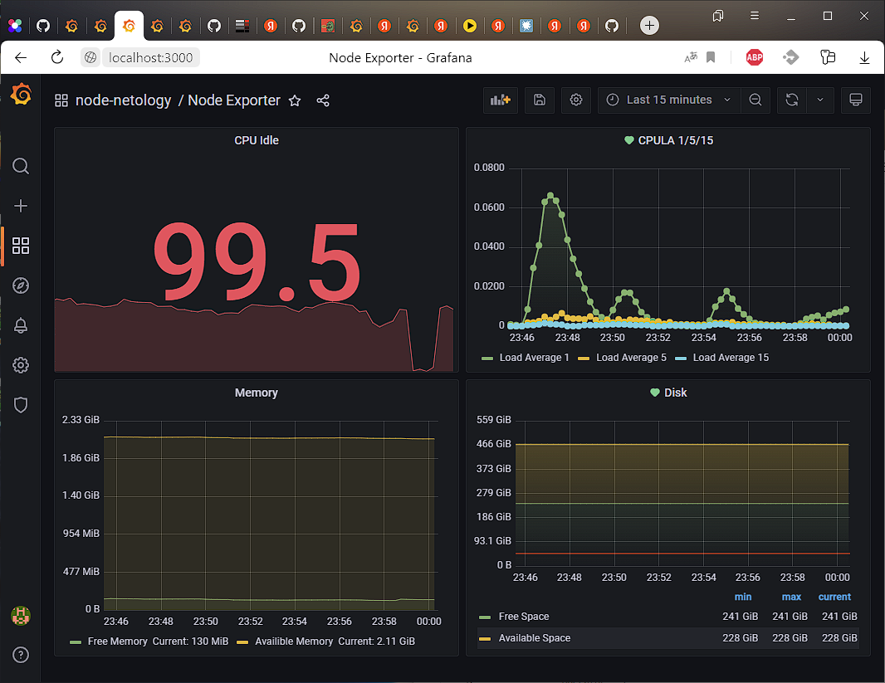

# Домашнее задание к занятию "10.03. Grafana"

### Задание 1
Используя директорию [help](./help) внутри данного домашнего задания - запустите связку prometheus-grafana.

Зайдите в веб-интерфейс графана, используя авторизационные данные, указанные в манифесте docker-compose.

Подключите поднятый вами prometheus как источник данных.

Решение домашнего задания - скриншот веб-интерфейса grafana со списком подключенных Datasource.



```
$ docker ps
CONTAINER ID   IMAGE                       COMMAND                  CREATED             STATUS             PORTS                    NAMES
142018558f7b   grafana/grafana:7.4.0       "/run.sh"                About an hour ago   Up About an hour   0.0.0.0:3000->3000/tcp   grafana
5bb2c1c0c3a1   prom/prometheus:v2.24.1     "/bin/prometheus --c…"   About an hour ago   Up About an hour   9090/tcp                 prometheus
3ec0333e21d1   prom/node-exporter:v1.0.1   "/bin/node_exporter …"   About an hour ago   Up About an hour   9100/tcp                 nodeexporter
```

## Задание 2

Создайте Dashboard и в ней создайте следующие Panels:
- Утилизация CPU для nodeexporter (в процентах, 100-idle)
> avg by(instance)(rate(node_cpu_seconds_total{job="nodeexporter",mode="idle"}[$__rate_interval])) * 100
- CPULA 1/5/15
> avg by (instance)(rate(node_load1{}[$__rate_interval]))
> avg by (instance)(rate(node_load5{}[$__rate_interval]))
> avg by (instance)(rate(node_load15{}[$__rate_interval]))
- Количество свободной оперативной памяти
> avg(node_memory_MemFree_bytes{instance="nodeexporter:9100",job="nodeexporter"})
> avg(node_memory_MemAvailable_bytes{instance="nodeexporter:9100", job="nodeexporter"})
- Количество места на файловой системе
> node_filesystem_avail_bytes{fstype="ext4",instance="nodeexporter:9100",job="nodeexporter",mountpoint="/"}

Для решения данного ДЗ приведите promql запросы для выдачи этих метрик, а также скриншот получившейся Dashboard.



## Задание 3
Создайте для каждой Dashboard подходящее правило alert (можно обратиться к первой лекции в блоке "Мониторинг").

Для решения ДЗ - приведите скриншот вашей итоговой Dashboard.



## Задание 4
Сохраните ваш Dashboard.

Для этого перейдите в настройки Dashboard, выберите в боковом меню "JSON MODEL".

Далее скопируйте отображаемое json-содержимое в отдельный файл и сохраните его.

В решении задания - приведите листинг этого файла.

[dashboard.json](dashboard.json)
