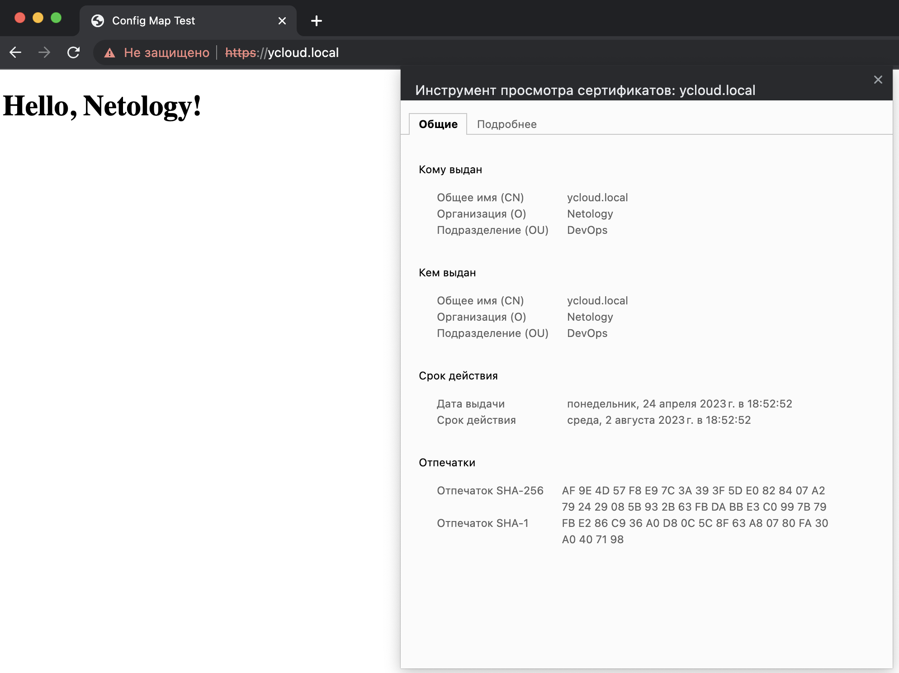

# Домашнее задание к занятию «Конфигурация приложений»

### Задание 1. Создать Deployment приложения и решить возникшую проблему с помощью ConfigMap. Добавить веб-страницу

1. Создать Deployment приложения, состоящего из контейнеров [~~busybox~~](FIX-ME) nginx и multitool.
2. Решить возникшую проблему с помощью ConfigMap.
3. Продемонстрировать, что pod стартовал и оба конейнера работают.
4. Сделать простую веб-страницу и подключить её к Nginx с помощью ConfigMap. Подключить Service и показать вывод curl или в браузере.
```
$ kubectl apply -f svc-mult-nginx.yml -f conf-mult-nginx.yml  -f conf-nginx-page.yml -f dep-mult-nginx.yml 
service/multinginx-svc created
configmap/multinginx-conf created
configmap/nginx-page created
deployment.apps/deployment-mn created
```
```
$ kubectl get deployments,pods,service,configmap
NAME                            READY   UP-TO-DATE   AVAILABLE   AGE
deployment.apps/deployment-mn   1/1     1            1           5s

NAME                                 READY   STATUS    RESTARTS   AGE
pod/deployment-mn-5b6499c6ff-x67rn   2/2     Running   0          5s

NAME                     TYPE        CLUSTER-IP       EXTERNAL-IP   PORT(S)                                       AGE
service/kubernetes       ClusterIP   10.152.183.1     <none>        443/TCP                                       121m
service/multinginx-svc   NodePort    10.152.183.169   <none>        80:31080/TCP,1180:31567/TCP,11443:31610/TCP   5s

NAME                         DATA   AGE
configmap/kube-root-ca.crt   1      121m
configmap/multinginx-conf    2      5s
configmap/nginx-page         1      5s
```
```
$ kubectl get ep
NAME             ENDPOINTS                                     AGE
kubernetes       10.128.0.8:16443                              128m
multinginx-svc   10.1.77.5:1180,10.1.77.5:80,10.1.77.5:11443   7m18s
```
```
$ curl 10.1.77.5:80
<!DOCTYPE html>
<html>
<head>
<title>Config Map Test</title>
</head>
<body>
  <h1>Hello, Netology!</h1>
</body>
</html>
```
5. Предоставить манифесты, а также скриншоты или вывод необходимых команд.  

[dep-mult-nginx.yml](dep-mult-nginx.yml)  
[svc-mult-nginx.yml](svc-mult-nginx.yml)  
[conf-mult-nginx.yml](conf-mult-nginx.yml)  
[conf-nginx-page.yml](conf-nginx-page.yml)

------

### Задание 2. Создать приложение с вашей веб-страницей, доступной по HTTPS 

1. Создать Deployment приложения, состоящего из Nginx.
```
$ kubectl apply -f conf-nginx.yml -f dep-nginx.yml -f svc-nginx.yml -f secret-nginx.yml -f conf-nginx-page.yml -f ingress-nginx.yml 
ingress.networking.k8s.io/http-ingress created
configmap/nginx-conf created
deployment.apps/nginx created
service/nginx-svc created
secret/nginx-secret created
configmap/nginx-page created
```
```
$ kubectl get deployments,pods,service,secret,configmap
NAME                    READY   UP-TO-DATE   AVAILABLE   AGE
deployment.apps/nginx   1/1     1            1           2m47s

NAME                       READY   STATUS    RESTARTS   AGE
pod/nginx-c58dcfdb-nq2jw   1/1     Running   0          2m47s

NAME                 TYPE        CLUSTER-IP      EXTERNAL-IP   PORT(S)         AGE
service/kubernetes   ClusterIP   10.152.183.1    <none>        443/TCP         4h51m
service/nginx-svc    NodePort    10.152.183.37   <none>        443:31443/TCP   2m47s

NAME                  TYPE   DATA   AGE
secret/nginx-secret   ssl    2      2m47s

NAME                         DATA   AGE
configmap/kube-root-ca.crt   1      4h51m
configmap/nginx-conf         1      2m47s
configmap/nginx-page         1      2m47s
```
2. Создать собственную веб-страницу и подключить её как ConfigMap к приложению.
3. Выпустить самоподписной сертификат SSL. Создать Secret для использования сертификата.
```
$ openssl req -x509 -nodes -days 100 -newkey rsa:2048 -keyout nginx.key -out nginx.crt
...........+.....+++++++++++++++++++++++++++++++++++++++++++++++++++++++++++++++++*.+++++++++++++++++++++++++++++++++++++++++++++++++++++++++++++++++*...+..................+.......+.....+.......+......+..+.+.....+..........+..+...+................+.....+......+.......+..+.+..+.+...........+....+..............+......................+.....+.........+....+...........+............+...+.......+...+......+...+..+...+...+.......+........+...+....+...+.......................+......+.+........+.+.....+....+..+.......+...+...+..............+......+...............+.+........+......+.+......+.................+......+..........+..+............+...+.......+.....+.+......+...........+...+.+.........+............+..+...+....+...+...........+......+......+.........+.+............+.....+.............+..+.+......+......+..................+..+...+....+...+..+.......+.....+.........+......+.+..............+.........+....+......+..+....+...+...+...+......+.....+.+..+......+....+........+....+.........+.........+...+.....+.......+..+...+...+...+.......+...+......+.........+.....+.+.....+...+.......+........+...+.......+...............+......+...........+...+......+.........+.+...........+.+..+......+......+......+...+....+..+.+............+..+.+..............+....+..+....+.........+..+.............+.........+..+....+......+........+.+..+...+.+.....+.+............+........+.......+.....+.+..+....+...........+....+.........+.....+.........+.+.....+.+......+..+.............+..+.......+......+.....+...+....+..........................+............+..........+..+......+.+.....+...+.+..+.......+..+......+.............+..............+...............+.+..+..........+...+..+....+.....+...+............+...+......+.+......+..+..........+...+.................+..........+..+....+......+......+.....+.......+..+.+..+............+....+.........+..+...+............+.+............+..+....+..+.......+........+..........+..+.+.....+.......+........+.+.........+..+....+......+..+...+..........+........+..............................+.+......+...+.....+.+.....+..........+.........+......+.....+......+...+....+..+.............+...+..+++++++++++++++++++++++++++++++++++++++++++++++++++++++++++++++++
..........+.....+.+......+..+.+..+...+....+...+...+..............+.+...........+.+........+.+++++++++++++++++++++++++++++++++++++++++++++++++++++++++++++++++*...+..+......+.+...+++++++++++++++++++++++++++++++++++++++++++++++++++++++++++++++++*.....+......+.........+...+......+......+...........+.........+.+..+......+....+..+....+...........+.+...+...........+....+......+...+......+.....+.+...+..+..........+..................+..+.+.....+...+....+...+........+.......+...+......+.....+......+.............+..............+.......+........+...............+...+....+.....+.+........+....+........+....+...+..+....+++++++++++++++++++++++++++++++++++++++++++++++++++++++++++++++++
-----
You are about to be asked to enter information that will be incorporated
into your certificate request.
What you are about to enter is what is called a Distinguished Name or a DN.
There are quite a few fields but you can leave some blank
For some fields there will be a default value,
If you enter '.', the field will be left blank.
-----
Country Name (2 letter code) [AU]:RU
State or Province Name (full name) [Some-State]:
Locality Name (eg, city) []:Moscow
Organization Name (eg, company) [Internet Widgits Pty Ltd]:Netology
Organizational Unit Name (eg, section) []:DevOps
Common Name (e.g. server FQDN or YOUR name) []:ycloud.local
Email Address []:root@ycloud.local
```
```
$ cat nginx.key | base64
LS0tLS1CRUdJTiBQUklWQVRFIEtFWS0tLS0tCk1JSUV2QUlCQURBTkJna3Foa2lHOXcwQkFRRUZB
QVNDQktZd2dnU2lBZ0VBQW9JQkFRREF3WjRmaEd2aWJSbGEKRWo5MVhHeXl0OWZBeHc1ZEJ6eitt
ZXNoVTJCTGswRFpWVjZLNmw4bVdOL21kcVNmdVVLZ2hNcVF2SGlralRqSAp3ZVNQQ2ZkazFHNzFB
eVM1a0ptNWJkQ3k4S3plcGZxQ3JYOVR6a0xtWWlkNzloQ2Q3OUZkV3I1Tk1ZTmwzR2pvCm45ZHpk
VmRQZnByQTBsa1M1Yjg2aVA5Ti9vcWFJRXNHb1kxcTVhV1BieGhOOWw2NExybDRNTmVwNmE2STcy
T3oKdmtnOTM0QlMrWjJwVTdVRWNJR1lhSUcvZ0RlSUNDdERiVU9TZzhZa1NFNFMvTFBRQzJTb29R
Y3ZqVitRQ1hEZgpBVU1oVzkvNUM0ZWJCMi9oL2hvc3VNM2VkUm5BeEtGcGszd3FIVmkrQTFhV25D
cVowZ0NkNjZnMmM1OGFZL3NHCkFVZDdISE1UQWdNQkFBRUNnZ0VBRElyc3g1ODl4K3VTZVQ1enU2
YktlZXlsa09sREFZR3RrZUdoSDdlRnJoVkUKWkgvK0dXcjd5d3FBYzBZb0d5NmFhOGlJUjlmRHYr
MWlrdmtHYnRwV3EweDVkZDhBL2tRdkJKWmxQS2VWa0IxYgp5aklROVhxWDl0YlBPKzA4a3BKZTNN
VEJXbE9NK2MxWVZEN0diY0JtY0lsTDk1MFlaN2JrZFNJaC9zaS82eHh1CjYvd0dKS3Y0WlNmVk5G
aXY0VTV1Q0VyZHNxZ0t3SzU5aVdrRnprTWs0Y3kxSmlyS3BHei8wSDc3KzFHM3hmTE0KZUNVdjZ5
Y0tMeUFyVHNzNWNLbzhka3dKV3JGTnFlT3c1NmVFUzlPWmNidzBUSXMrUWZySEtDVXBpeVpDQm55
VAoydG4xVkZzYSs2ODF6S0UzYUhJT1BhcGFqR1BFQVFhdGxKYkJxK2QwK1FLQmdRRGJpTlJjamJT
bmNkRGMyclhECk5raHNyUndjQmVHOWZCek9nWWVrS295UzF6bllCMUU5Z0tLZ3pJTm5wdDNkdmRK
eGJRVFFxWC80MEd6NHE4b2EKaTFoampWUENlNmJKTmtaZEQ1ZFFjUkVIMERzRC9hMzQ2V3hpaGt6
UkhTZTczQkxyV0hzS0tsdDB1M21pQVpsNgo5czJadlhNSU9NOVpKTThRQUpubXFrbnZHUUtCZ1FE
Z3hoeUxJMXcxNkE2bDBEOEF4M3lCaEVmNE5jejNsSG9WCnNvWm9rWE4wbllwM3o1T0t2ZGhlZUhi
eWhKWkhjTXBHdTRGRWhDcUlFbzFyQkN6cGFtcjF5ZlhxT1JsU1dzTGgKTHd3UU0vbTZHQlpNS1Y0
NEUxN2t0U1BoSDFKbUdsTkRRME1kdWpkS09YUkdocG9ydGNkbVVzTjRXeVo4WEFOSApGNE5HMThj
MUN3S0JnRGhBdW5HdzJkNmlHbXZOR3hBWFk3MTlLaHZBSWhUa3JaajR0ZUlLQ1JWRFV3NFk2ZWRC
CmcrcUNIUlc5TzFLclpqWXNRalNaaWpJZWJoM1dIeVpvR0ZFQ0VMbGY1OS9kS1hDRkl6ZTRrUzJZ
WE5icjlOMDQKS3M2Z0xTVFVQSzgxZUIrWC80Y2VUV3IrOHU3aFRBdW5IQTNON3FEbnRiSFk3Ym5p
L1l5T2kvMVpBb0dBTnRFNQovdGpsMFNQQ0JzQk56VFBaY29DL1NKSmVaWGJwZTBjcHJuRGlsbXNo
Yk96THo4ZFM4Rjh5cXh5WXhkMkZCMUVOClNwZHRBL2g2VXNJVzdlb05JZHBhUmdBYzQ4L012VHhM
RmR5SEo5SmVCYjhGQW1uKzk0b1JzUUtCaHZNZW9VWFQKSlhuWHFCdHc5dzQycFRoVTQraUZVV0h4
ZGR5KzArU3hHR0xoYTFjQ2dZQnU3cnBubDI1SGRxVWh3VW9TRGpsWApnZ1NqeTQxTm5yNmQveE1u
MFFCQnZvWEZlVmdZNkZqZnd1d2sxbWJzeFlJcmg2b3ZaVzBwcFp4cVFVNlhJVVFpCmxlam1kUnN3
SDJCbmI1aGdIcGYxQWxxTHNBOXpzemtiaWNpYjlRNlJPM2N3MURROEQ1azZNcmdsMmlXK2NKZXEK
OWlnMmlnOTA2L0gzcCtlY3lsZXV4Zz09Ci0tLS0tRU5EIFBSSVZBVEUgS0VZLS0tLS0K
```
```
$ cat nginx.crt | base64
LS0tLS1CRUdJTiBDRVJUSUZJQ0FURS0tLS0tCk1JSUVBekNDQXV1Z0F3SUJBZ0lVTzZRV2FxZFZa
VGk1UXY3aWUyUTBsU210cURNd0RRWUpLb1pJaHZjTkFRRUwKQlFBd2daQXhDekFKQmdOVkJBWVRB
bEpWTVJNd0VRWURWUVFJREFwVGIyMWxMVk4wWVhSbE1ROHdEUVlEVlFRSApEQVpOYjNOamIzY3hF
VEFQQmdOVkJBb01DRTVsZEc5c2IyZDVNUTh3RFFZRFZRUUxEQVpFWlhaUGNITXhGVEFUCkJnTlZC
QU1NREhsamJHOTFaQzVzYjJOaGJERWdNQjRHQ1NxR1NJYjNEUUVKQVJZUmNtOXZkRUI1WTJ4dmRX
UXUKYkc5allXd3dIaGNOTWpNd05ESTBNVFUxTWpVeVdoY05Nak13T0RBeU1UVTFNalV5V2pDQmtE
RUxNQWtHQTFVRQpCaE1DVWxVeEV6QVJCZ05WQkFnTUNsTnZiV1V0VTNSaGRHVXhEekFOQmdOVkJB
Y01CazF2YzJOdmR6RVJNQThHCkExVUVDZ3dJVG1WMGIyeHZaM2t4RHpBTkJnTlZCQXNNQmtSbGRr
OXdjekVWTUJNR0ExVUVBd3dNZVdOc2IzVmsKTG14dlkyRnNNU0F3SGdZSktvWklodmNOQVFrQkZo
RnliMjkwUUhsamJHOTFaQzVzYjJOaGJEQ0NBU0l3RFFZSgpLb1pJaHZjTkFRRUJCUUFEZ2dFUEFE
Q0NBUW9DZ2dFQkFNREJuaCtFYStKdEdWb1NQM1ZjYkxLMzE4REhEbDBIClBQNlo2eUZUWUV1VFFO
bFZYb3JxWHlaWTMrWjJwSis1UXFDRXlwQzhlS1NOT01mQjVJOEo5MlRVYnZVREpMbVEKbWJsdDBM
THdyTjZsK29LdGYxUE9RdVppSjN2MkVKM3YwVjFhdmsweGcyWGNhT2lmMTNOMVYwOSttc0RTV1JM
bAp2enFJLzAzK2lwb2dTd2FoaldybHBZOXZHRTMyWHJndXVYZ3cxNm5wcm9qdlk3TytTRDNmZ0ZM
NW5hbFR0UVJ3CmdaaG9nYitBTjRnSUswTnRRNUtEeGlSSVRoTDhzOUFMWktpaEJ5K05YNUFKY044
QlF5RmIzL2tMaDVzSGIrSCsKR2l5NHpkNTFHY0RFb1dtVGZDb2RXTDREVnBhY0twblNBSjNycURa
em54cGord1lCUjNzY2N4TUNBd0VBQWFOVApNRkV3SFFZRFZSME9CQllFRlBWcVEzTHRIOGtXZTIw
ZVZ0cW9YWU1xdS9iTU1COEdBMVVkSXdRWU1CYUFGUFZxClEzTHRIOGtXZTIwZVZ0cW9YWU1xdS9i
TU1BOEdBMVVkRXdFQi93UUZNQU1CQWY4d0RRWUpLb1pJaHZjTkFRRUwKQlFBRGdnRUJBR1lQQUdm
RlV3bWFQVjJQTTVlazhpZlBnNGtNb05BMDBrWFlOcVl2R0FxcHQ3SEVCSXNQUXBJeApHSW9iS25u
dHV5UW51cjJXUTJpTE5yTjdVcW9rb1I4THRzSEJKaDZOTTh3blVDTE52aDBQMklRcXd2MHp3d1VS
CnV1QWFyUlZ4d1hRY2JPSHZhRlNOb3cwNFFCS0c5aDNTT1o0REZvVFNRT3pWYXFRcXBLaDdyZi9L
U01WaEcvekgKczVFSWFrZjhwUnkzMmFBbXZMSHZlbDc3c0RsTEhiNnhJekxGbEJEMWQ2OEpjK1JX
M0FTU3M5dHdNZVJ3RjhUTgo0NkxMREtiVlZYUjl1Wm9uM2lFTDc2MGhEQXNySitmQmdlMkE1SFNu
QkMvZ2djb21saGdocU05RUROYjg3M3gyCk5yczgvelZ1NHB1VlRhN1psaExRVkYyeG95L0d1ejQ9
Ci0tLS0tRU5EIENFUlRJRklDQVRFLS0tLS0K
```
4. Создать Ingress и необходимый Service, подключить к нему SSL в вид. Продемонстировать доступ к приложению по HTTPS.  
  
4. Предоставить манифесты, а также скриншоты или вывод необходимых команд.  
[dep-nginx.yml](dep-nginx.yml)  
[conf-nginx.yml](conf-nginx.yml)  
[conf-nginx-page.yml](conf-nginx-page.yml)  
[svc-nginx.yml](svc-nginx.yml)  
[secret-nginx.yml](secret-nginx.yml)  
[ingress-nginx.yml](ingress-nginx.yml)  
------

